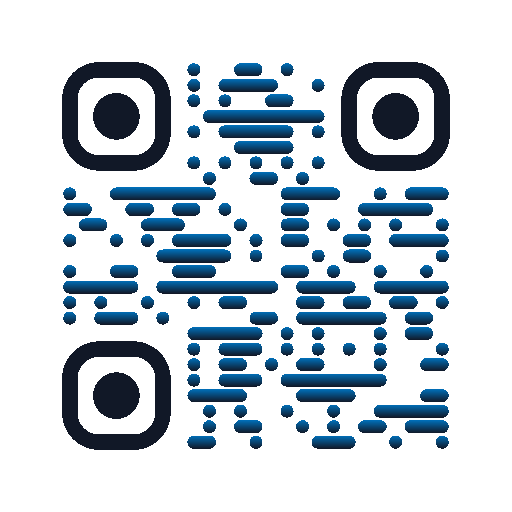

# iskill-qrcode

二维码「生成 + 解码」二合一 CLI。**零依赖**（Node ≥ 24 标准库）、确定性输出
（同文本同图）、生成 5 款风格化 SVG，解码自带 RS 纠错——轻微旋转、透视、
污损都能解。

## 五款风格

| | | | | |
|---|---|---|---|---|
|  |  |  |  |  |
| classic 经典 | rounded 圆角 | dots 渐变点阵 | icon 中心徽章 | photo 中心圆图 |

（以上即真实产出：`examples/` 里的 SVG 全部可扫，手机试试。）

## 快速上手

```bash
node scripts/qr.mjs encode "https://example.com" --out qr.svg
node scripts/qr.mjs encode "https://paypal.me/you" --style icon --icon ♥ --accent "#10C8A1" --out qr.svg
node scripts/qr.mjs encode "https://example.com" --style photo --image avatar.jpg --out qr.svg

node scripts/qr.mjs decode screenshot.png        # 解码图片里的码
node scripts/qr.mjs selfcheck                    # 编码器回归自检
```

## 特性

- **确定性**：无随机种子，同文本永远同图，可进 git。
- **零依赖**：编码器纯标准库；解码借 macOS `sips` 解图。
- **体积小**：SVG 按行游程合并，一张 2–16 KB，任意缩放不糊。
- **中心可定制**：icon 徽章 / photo 圆图，孔径按 M 级纠错预算标定，实测可扫。
- **解码带纠错**：Berlekamp–Massey + Chien + Forney 全套 RS 译码，
  输出注明版本/掩码/纠错码字数。
- **自验证**：`selfcheck` 做编码↔解码 round-trip（v1–10 全版本全掩码）。

## 选项

| 参数 | 说明 |
| --- | --- |
| `--style` | `classic` / `rounded` / `dots` / `icon` / `photo`（默认 classic） |
| `--out` | `.svg` 文件或目录 |
| `--size <px>` | 像素边长（默认 512） |
| `--dark` / `--accent` | 码色 / 渐变·描边色（hex） |
| `--icon <字符>` | 中心徽章字符（默认 `♥`） |
| `--image <路径>` | 中心圆图（png/jpg/gif/webp） |

## 边界（诚实声明）

- 编码：byte 模式、纠错级别 M、版本 1–10（≤213 字节）。
- 解码：同上范围；L/Q/H 级、alnum/kanji 模式、SVG 直接解码不支持。
- 图像解码依赖 `sips`（macOS 自带）；Linux 下 encode 全功能可用，decode 需自转 BMP。

## 安装（AI skill）

对 agent 说：**请帮我安装 Skill：aispin/iskill-qrcode**

## 同源注记

编码器与 `iskill-generate-sponsors` 的外链二维码同源（复制维护）；
完整实现说明与踩坑实录见 [SKILL.md](SKILL.md)。

> 共享真源：本仓库 `scripts/lib/qrcode.mjs` 为唯一真源（改文件须同 commit 升文件头 `@iskill-version`；消费方副本用 [iskill-dep-sync](https://github.com/aispin/iskill-dep-sync) 同步）。
